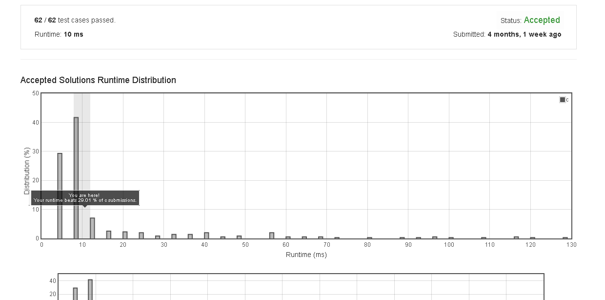

# Judge_Route_Circle

Initially, there is a Robot at position (0, 0). Given a sequence of its moves, judge if this robot makes a circle, which means it moves back to the original place.

The move sequence is represented by a string. And each move is represent by a character. The valid robot moves are R (Right), L (Left), U (Up) and D (down). The output should be true or false representing whether the robot makes a circle.

Example 1:
Input: "UD"
Output: true

Example 2:
Input: "LL"
Output: false


## submission solution

```c


int x = 0;
int y = 0;

void horizon(char action){
    if( action == 'R'){
        x++;
        return;
    }
    if( action == 'L'){
        x--;
        return;
    }
}

void vertical(char action){
    if( action == 'U'){
        y++;
        return;
    }
    if( action == 'D'){
        y--;
        return;
    }
}


bool judgeCircle(char* moves) {
    x = 0;
    y = 0;
    int size = strlen(moves);
    
    for(int i=0 ; i<size ; i++){
        char action = *(moves+i);
        
        if( action == 'R' || action == 'L' ){
            horizon(action);
            continue;
        }
        if( action == 'U' || action == 'D'){
            vertical(action);
            continue;
        }        
    }
    if( x == 0 && y == 0 ){
        return true;
    }
    else{
        return false;
    }
}


```

