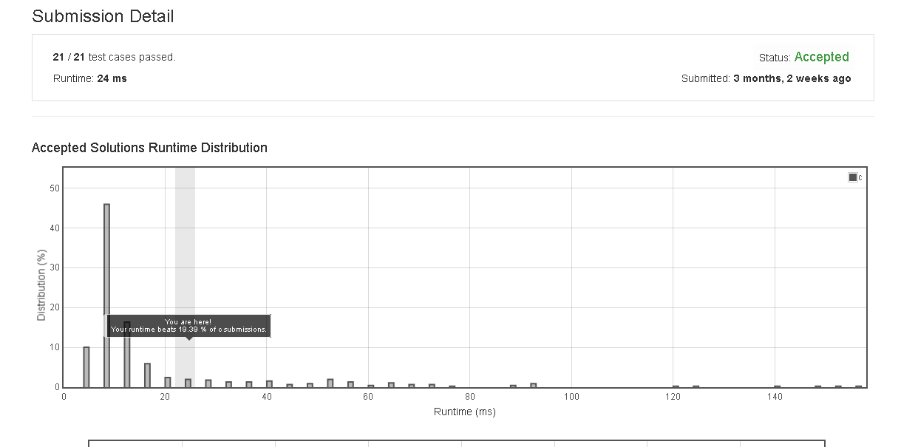

# Move_Zeroes

Given an array nums, write a function to move all 0's to the end of it while maintaining the relative order of the non-zero elements.

Example:

Input: [0,1,0,3,12]
Output: [1,3,12,0,0]
Note:

You must do this in-place without making a copy of the array.
Minimize the total number of operations.


## submission solution

```c

void moveZeroes(int* nums, int numsSize) {
    for(int a=0 ; a<2 ; a++){
        for(int i=0 ; i<numsSize-1 ; i++){
            if(*(nums+i) == 0){
                for(int j=i ; j<numsSize-1 ; j++){
                    int temp = *(nums+j);
                    *(nums+j) = *(nums+j+1);
                    *(nums+j+1) = temp;
                }
            }
        }
    }
    
}

```

