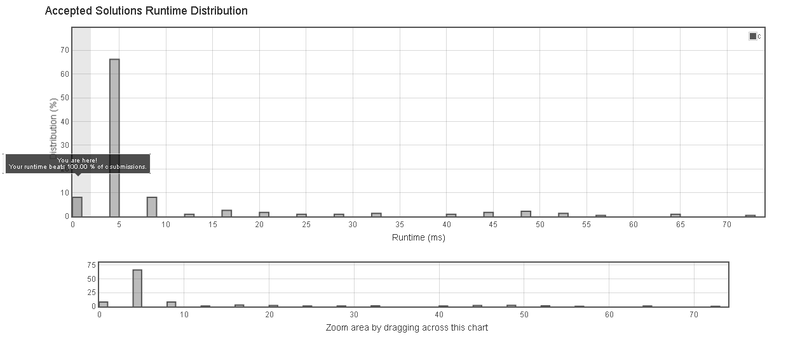

# Number Complement

Given a positive integer, output its complement number. The complement strategy is to flip the bits of its binary representation.

Note:
The given integer is guaranteed to fit within the range of a 32-bit signed integer.
You could assume no leading zero bit in the integer’s binary representation.

Example 1:
Input: 5
Output: 2
Explanation: The binary representation of 5 is 101 (no leading zero bits), and its complement is 010. So you need to output 2.

Example 2:
Input: 1
Output: 0
Explanation: The binary representation of 1 is 1 (no leading zero bits), and its complement is 0. So you need to output 0.


## submission solution

```c

int findComplement(int num) {
    for(int i=1 ; i<=num ; i=i*2){
        if(i>=0){
            num = num ^ i;    
        }
        else{
            break;
        }
    }
    printf("%d\n" , num);
    return num;
}


```

