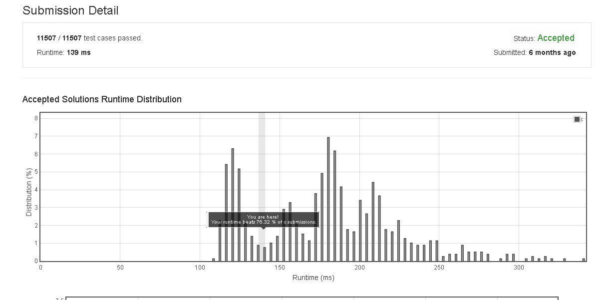

# Palindrome_Number

Determine whether an integer is a palindrome. An integer is a palindrome when it reads the same backward as forward.

Example 1:

Input: 121
Output: true


Example 2:

Input: -121
Output: false
Explanation: From left to right, it reads -121. From right to left, it becomes 121-. Therefore it is not a palindrome.


Example 3:

Input: 10
Output: false
Explanation: Reads 01 from right to left. Therefore it is not a palindrome.
Follow up:

Coud you solve it without converting the integer to a string?


## submission solution

```c


bool isPalindrome(int x) {
    char buf[10000];
    sprintf(buf , "%d" , x);
    unsigned int len = strlen(buf);
    for(unsigned int i=0 ; i<(len/2) ; i++){
        if(buf[i] != buf[len-(i+1)]){
            return false;
        }
    }
    return true;
}


```

