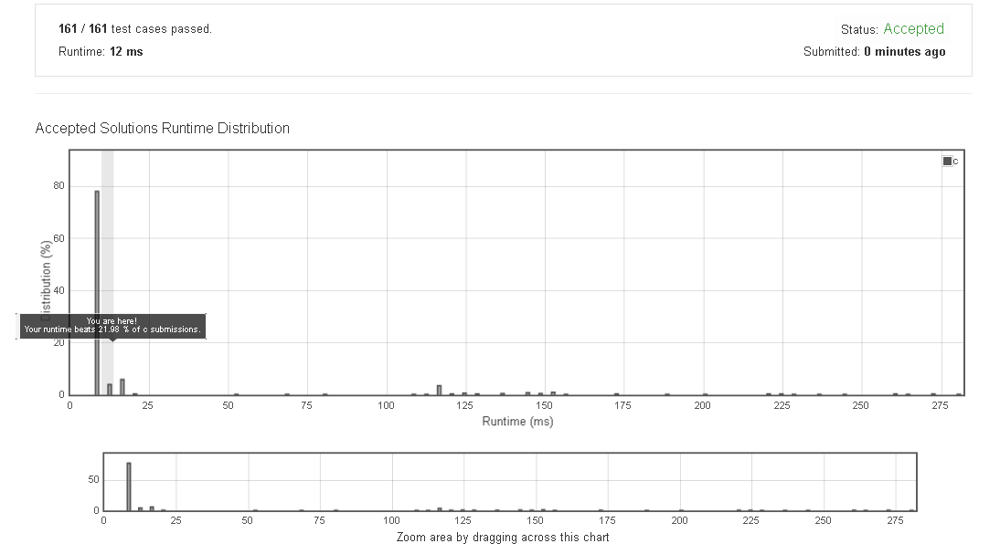

# Remove_Duplicates_from_Sorted_Array

Given a sorted array nums, remove the duplicates in-place such that each element appear only once and return the new length.

Do not allocate extra space for another array, you must do this by modifying the input array in-place with O(1) extra memory.

Example 1:

Given nums = [1,1,2],

Your function should return length = 2, with the first two elements of nums being 1 and 2 respectively.

It doesn't matter what you leave beyond the returned length.
Example 2:

Given nums = [0,0,1,1,1,2,2,3,3,4],

Your function should return length = 5, with the first five elements of nums being modified to 0, 1, 2, 3, and 4 respectively.

It doesn't matter what values are set beyond the returned length.
Clarification:

Confused why the returned value is an integer but your answer is an array?

Note that the input array is passed in by reference, which means modification to the input array will be known to the caller as well.

Internally you can think of this:

// nums is passed in by reference. (i.e., without making a copy)
int len = removeDuplicates(nums);

// any modification to nums in your function would be known by the caller.
// using the length returned by your function, it prints the first len elements.
for (int i = 0; i < len; i++) {
    print(nums[i]);
}


## submission solution

```c
/*解法
currentNum 設定為不重複的元素值 , 
index 是不重複的元素陣列索引 ,

一陣列 {1 , 2 , 2 , 3}
先設定 
currentNum = num[0]
index = 0

i==1 時,
currentNum != num[1]
currentNum = num[1]
index++
num[index] = currentNum
就元素重複設定自己一次

i==2 時,
currentNum == num[2]
所以跳過
index 還是等於 1

i==3 時,
currentNum != num[3]
currentNum = num[3]
index++
index 等於 2
num[index] = currentNum

loop traversal 所有元素
currentNum 比對不重複的元素
index 定位不重複元素的設定位置
就可以把不重複的陣列元素寫出來
不重複陣列 length == index + 1

*/


int removeDuplicates(int* nums, int numsSize) {
    if(!numsSize){
        return 0;
    }
    int currentNum = nums[0];
    int index= 0;
    for(int i=1 ; i<numsSize ; i++){
        if(currentNum != nums[i]){
            currentNum = nums[i];
            index++;
            nums[index] = currentNum;
        }
        continue;
    }
    return index+1;
}

```

