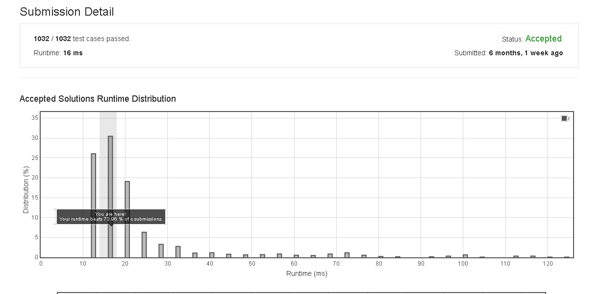

# Reverse_Integer

Given a 32-bit signed integer, reverse digits of an integer.

Example 1:

Input: 123
Output: 321


Example 2:

Input: -123
Output: -321


Example 3:

Input: 120
Output: 21


Note:
Assume we are dealing with an environment which could only store integers within the 32-bit signed integer range: [−231,  231 − 1]. For the purpose of this problem, assume that your function returns 0 when the reversed integer overflows.

## submission solution

```c

int reverse(int x) {
    long long val = 0;
	do 
	{
		val = val * 10 + x % 10;
		x /= 10;
	} while (x);
	
	return (val > INT_MAX || val < INT_MIN) ? 0 : val;
}
/*
int reverse(int x) {
    if(x >= INT_MAX || x<= INT_MIN){
        return 0;
    }
    char * x_char = (char *)malloc(130);
    char * ans = (char *)malloc(260);
    ans[0] = '-';
    int i=0;
    sprintf(x_char , "%d" , x);
    if( *x_char == '-' ){
        while(x_char[i] != '\0'){
            x_char[i] = x_char[i+1];
            i++;
        }
        i=0;
        
        for(int j=0 ; j<(strlen(x_char)/2) ; j++){
            
            int end = (strlen(x_char)-1-j);
            char tmp = x_char[j];
            x_char[j] = x_char[end];
            x_char[end] = tmp;
        }
        strcat(ans , x_char);
        return strtol(ans , NULL , 10);
    }
    else{
        for(int j=0 ; j<(strlen(x_char)/2) ; j++){
            int end = (strlen(x_char)-1-j);
            char tmp = x_char[j];
            x_char[j] = x_char[end];
            x_char[end] = tmp;
        }
        return strtol(x_char , NULL , 10);
    }
    
}
*/


```

