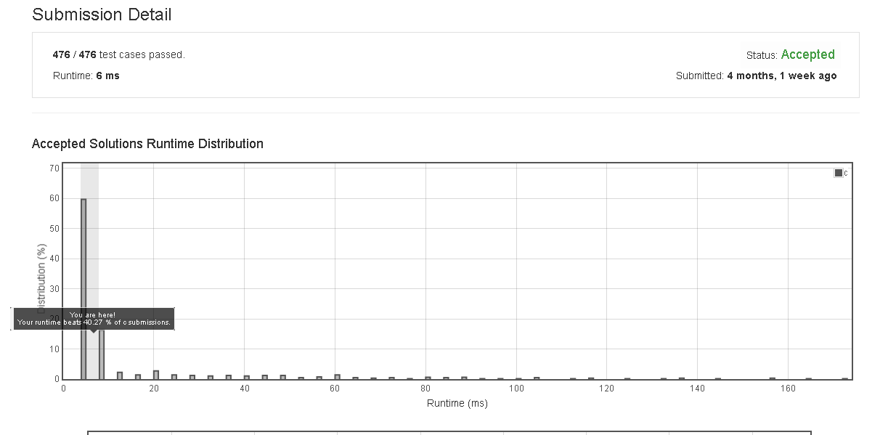

# Reverse_String

Write a function that takes a string as input and returns the string reversed.

Example:
Given s = "hello", return "olleh".


## submission solution

```c
char* reverseString(char* s) {
    int size = strlen(s);
    char* ans = strdup(s);
    for(int i=0 ; i<(size/2) ; i++){
        char temp = *(ans+i);
        *(ans+i) = *(ans+size-1-i);
        *(ans+size-1-i) = temp;
    }
    return ans;
}


```

