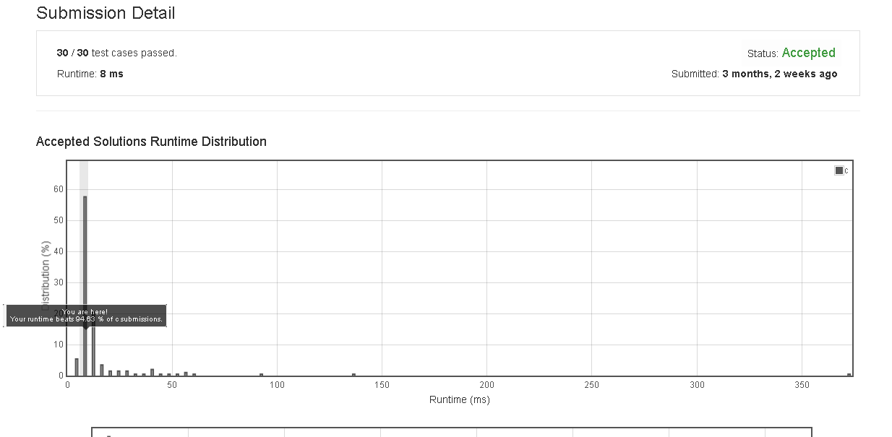

# Reverse_Words_in_a_String_III

Given a string, you need to reverse the order of characters in each word within a sentence while still preserving whitespace and initial word order.

Example 1:
Input: "Let's take LeetCode contest"
Output: "s'teL ekat edoCteeL tsetnoc"
Note: In the string, each word is separated by single space and there will not be any extra space in the string.


## submission solution

```c


void get_word(char** s ,int start , int end){
    /*size == (end - start + 1) + start */
    int size = ((end - start + 1))+start;
    
    char* temp = (char*) malloc((end-start+1) * sizeof(char));
    
    for(int i=start ; i<size ; i++){
        *(temp+(size-1)-i) = *((*s)+i);
    }
    
    int index = 0;
    for(int i=start ; i<size ; i++){
        *((*s)+i) = *(temp+index++);
    }
    free(temp);
    
    return;
}

char* space_pos(char* s , int size){
    char* ans = (char*) malloc(size * sizeof(char));
    strcpy(ans , s);
    int start = 0;
    int end = 0;
    int pos = 0;
    
    while( pos != (size-1)){
        if( *(s+pos) == ' '){
            end = pos-1;
            get_word(&ans , start , end);
            start = pos+1;
        }
        pos++;
    }
    get_word(&ans , start , size-1);
    return ans;
}

char* reverseWords(char* s) {
    int size = strlen(s);
    if(size == 0){
        return s;
    }
    return space_pos(s , size);
}

```

