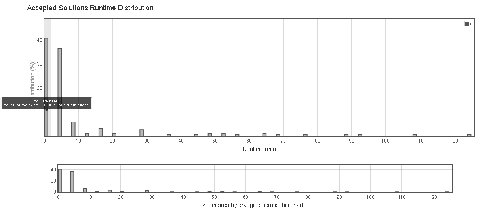

# 728. Self Dividing Numbers

A self-dividing number is a number that is divisible by every digit it contains.

For example, 128 is a self-dividing number because 128 % 1 == 0, 128 % 2 == 0, and 128 % 8 == 0.

Also, a self-dividing number is not allowed to contain the digit zero.

Given a lower and upper number bound, output a list of every possible self dividing number, including the bounds if possible.

Example 1:
Input: 
left = 1, right = 22
Output: [1, 2, 3, 4, 5, 6, 7, 8, 9, 11, 12, 15, 22]
Note:

The boundaries of each input argument are 1 <= left <= right <= 10000.


## submission solution

```c

/**
 * Return an array of size *returnSize.
 * Note: The returned array must be malloced, assume caller calls free().
 */


int* selfDividingNumbers(int left, int right, int* returnSize) {
    /*D:被除數 , digit:個位數 , returnSize:符合條件的數字陣列的數量*/
    int D = 0;
    int digit = 0;
    *returnSize = 0;
    /*答案 int 指標變數 , malloc 尺寸範圍預設為 right - left + 1*/
    int* ans = (int*) malloc( (right - left +1 ) * sizeof(int));
    
    for(int i=left ; i<=right ; i++){
        D = i;
        while( D!=0 ){
            /*把被除數 %10 找出每個個位數，用來除以原被除數，測試是否為 self-divider*/
            digit = D%10;
            D = D/10;
            /*每測試過一個個位數後，把 D/10 讓 D 往右 shift 1 位數，直到 D == 0*/
            if( digit ){
                /*如果 digit 含有 0 的原被除數要剔除掉*/
                if((i%digit)==0 ){
                    if(D==0){
                        /*測試到最後，每一位數都是 self-divider時，就把原被除數加入 ans 指標*/
                        *(ans+*(returnSize)) = i;
                        *(returnSize) = *(returnSize) +1;
                    }
                }
                else{
                    break;
                }
            }
            else{
                break;
            }
        }
    }
    return ans;
}


```




