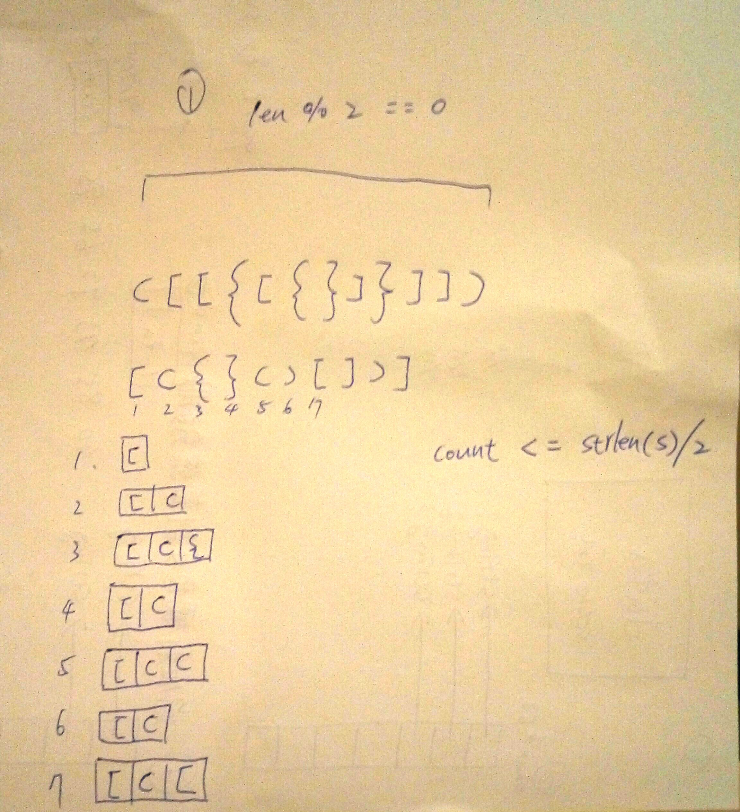

# Valid_Parentheses

Given a string containing just the characters '(', ')', '{', '}', '[' and ']', determine if the input string is valid.

An input string is valid if:

Open brackets must be closed by the same type of brackets.
Open brackets must be closed in the correct order.
Note that an empty string is also considered valid.

Example 1:

Input: "()"
Output: true


Example 2:

Input: "()[]{}"
Output: true


Example 3:

Input: "(]"
Output: false


Example 4:

Input: "([)]"
Output: false


Example 5:

Input: "{[]}"
Output: true


## submission solution

```c

bool isValid(char* s) {
    /*括號需要兩兩相對*/
    if(strlen(s) % 2 != 0){return false;}
    
    int str_len = strlen(s);
    char *item = malloc(sizeof(char) * str_len);
    int count = 0;
    
    for(int i=0 ; i<str_len ; i++){
        
        if(count > str_len+1){
            return false;
        }
        
        switch(s[i]){
            case '(':{
                item[count++] = '(';
                break;
            }
            case '[':{
                item[count++] = '[';
                break;
            }
            case '{':{
                item[count++] = '{';
                break;
            }
            case ')':{
                if(item[count-1] == '('){
                    item[count--];
                    break;
                }
                return false;
            }
            case ']':{
                if(item[count-1] == '['){
                    item[count--];
                    break;
                }
                return false;
            }
            case '}':{
                if(item[count-1] == '{'){
                    item[count--];
                    break;
                }
                return false;
            }
        }
    }
    
    if(count == 0){
        return true;
    }
    
    return false;
}


```


