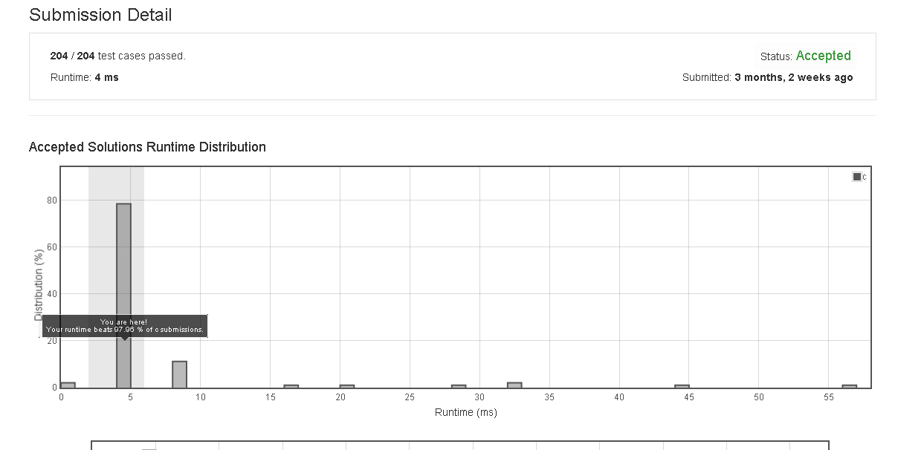

# Binary_Number_with_Alternating_Bits

Given a positive integer, check whether it has alternating bits: namely, if two adjacent bits will always have different values.

Example 1:
Input: 5
Output: True
Explanation:
The binary representation of 5 is: 101

Example 2:
Input: 7
Output: False
Explanation:
The binary representation of 7 is: 111.

Example 3:
Input: 11
Output: False
Explanation:
The binary representation of 11 is: 1011.

Example 4:
Input: 10
Output: True
Explanation:
The binary representation of 10 is: 1010.


## submission solution

```c


bool hasAlternatingBits(int n) {
    if(n == 0 || n == 1){
        return true;
    }
    int pre_status = 0x01 & n;
    n=n>>1;
    while(n>0){
        int next_status = 0x1 & n;
        if(pre_status == next_status){
            return false;
        }
        pre_status = next_status;
        n=n>>1;
    }
    return true;
    
}

/*
case 1

101

000000000 00000000 00000000 00000101
000000000 00000000 00000000 00000001
    1
    
000000000 00000000 00000000 00000010
000000000 00000000 00000000 00000001
    0
    
000000000 00000000 00000000 00000001
000000000 00000000 00000000 00000001
    1

    

case 2

1010
    
000000000 00000000 00000000 00001010
000000000 00000000 00000000 00000001
    0    
000000000 00000000 00000000 00000101
000000000 00000000 00000000 00000001
    1
000000000 00000000 00000000 00000010
000000000 00000000 00000000 00000001    
    0
000000000 00000000 00000000 00000001
000000000 00000000 00000000 00000001
    1
    
*/


```

