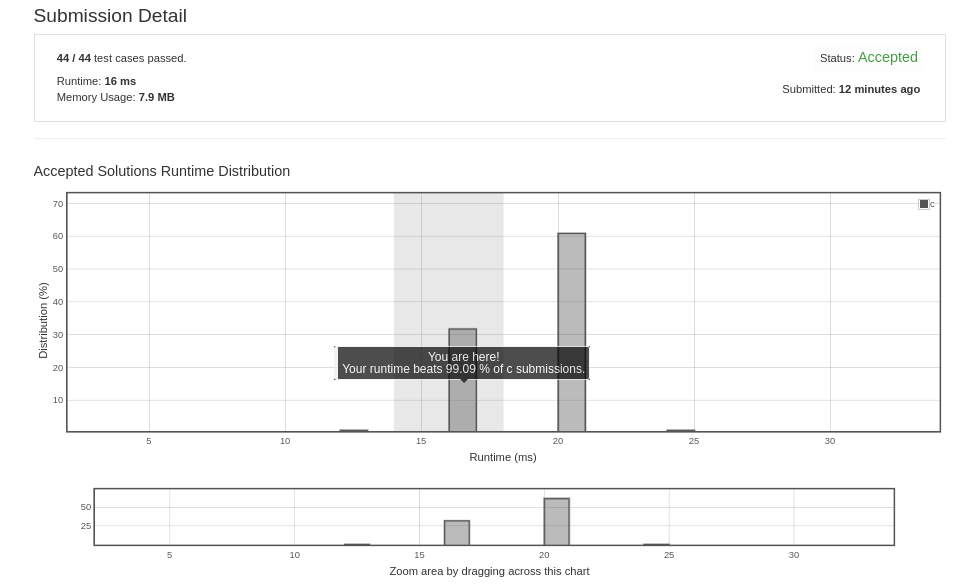

# Count Negative Numbers in a Sorted Matrix

Given a m * n matrix grid which is sorted in non-increasing order both row-wise and column-wise. 

Return the number of negative numbers in grid.

Example 1:

Input: grid = [[4,3,2,-1],[3,2,1,-1],[1,1,-1,-2],[-1,-1,-2,-3]]
Output: 8
Explanation: There are 8 negatives number in the matrix.
Example 2:

Input: grid = [[3,2],[1,0]]
Output: 0
Example 3:

Input: grid = [[1,-1],[-1,-1]]
Output: 3
Example 4:

Input: grid = [[-1]]
Output: 1
 

Constraints:

m == grid.length
n == grid[i].length
1 <= m, n <= 100
-100 <= grid[i][j] <= 100


## submission solution

```c


int countNegatives(int** grid, int gridSize, int* gridColSize){
    
    if(gridSize == 0 && *gridColSize == 0){return 0;}
    
    // int count = 0;
    
    /* pointer dereferrence style*/
    // for(int i=0 ; i<gridSize ; i++){
    //     for(int j=0 ; j<*gridColSize ; j++){
    //         if( *(*(grid+i)+j) < 0){
    //             count++;
    //         }
    //     }
    // }
    
//     int count = 0;
    
//     /* array style */
//     for(int i=0 ; i<gridSize ; i++){
//         for(int j=0 ; j<*gridColSize ; j++){
//             if(grid[i][j] < 0){
//                 count++;
//             }
//         }
//     }
//     return count;
    
    /* in-place counting style */
    for(int i=0 ; i<gridSize ; i++){
        for(int j=0 ; j<*gridColSize ; j++){
            
            if(i==0 && j==0){
                if(grid[0][0] < 0){
                    grid[0][0] = 1;
                    continue;
                }
                grid[0][0] = 0;
                continue;
            }
            
            if(grid[i][j] < 0){
                grid[0][0]++;
            }
        }
    }
    return grid[0][0];
    
}


```

