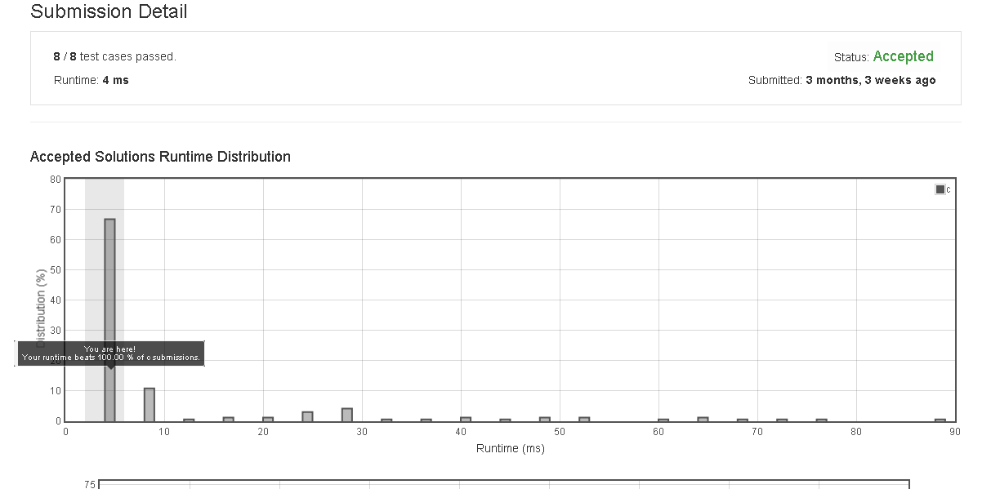

# Fizz_Buzz

Write a program that outputs the string representation of numbers from 1 to n.

But for multiples of three it should output “Fizz” instead of the number and for the multiples of five output “Buzz”. For numbers which are multiples of both three and five output “FizzBuzz”.

Example:

n = 15,

Return:
[
    "1",
    "2",
    "Fizz",
    "4",
    "Buzz",
    "Fizz",
    "7",
    "8",
    "Fizz",
    "Buzz",
    "11",
    "Fizz",
    "13",
    "14",
    "FizzBuzz"
]


## submission solution

```c

/**
 * Return an array of size *returnSize.
 * Note: The returned array must be malloced, assume caller calls free().
 */
char** fizzBuzz(int n, int* returnSize) {
    *returnSize = n;
    char** arr = (char**) malloc(n * sizeof(char*));
    
    for(int j=0 ; j<n ; j++){
        *(arr+j) = (char*) malloc( 10 * sizeof(char));
    }
    
    for(int i=0 ; i<n ; i++){
        int number = i+1;
        if( number %3 != 0 && number %5 != 0){
            sprintf( *(arr + i) , "%d" , number );
            continue;
        }
        strcpy(*(arr+i) , "");
        if( number %3 == 0){
            strcat(*(arr+i) , "Fizz");    
        }
        
        if( number %5 == 0){
            strcat(*(arr+i) , "Buzz");
        }
    }
    
    
    return arr;
}


```

