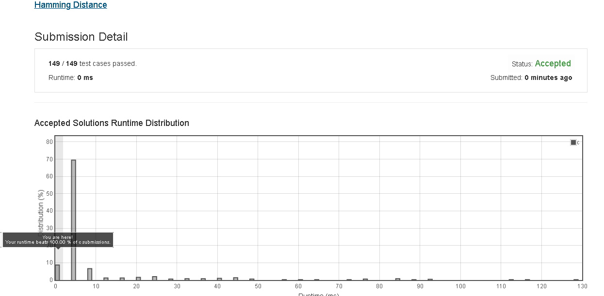

# Hamming_Distance

The Hamming distance between two integers is the number of positions at which the corresponding bits are different.

Given two integers x and y, calculate the Hamming distance.

Note:
0 ≤ x, y < 231.

Example:

Input: x = 1, y = 4

Output: 2

Explanation:
1   (0 0 0 1)
4   (0 1 0 0)
       ↑   ↑

The above arrows point to positions where the corresponding bits are different.


## submission solution

```c
/*
計算兩 integers 之間的不同 bits 的數量
example:
93 , 73

93 : 01011101
73 : 01001001
----------------
*/


int bit_count(int res){
    int count = 0;
    while(res){
        if(res & 1){
            count++;
        }
        res >>= 1;
    }
    return count;
}

int hammingDistance(int x, int y) {
    if(x == y){
        return 0;
    }
    return bit_count((x^y));
}


```

