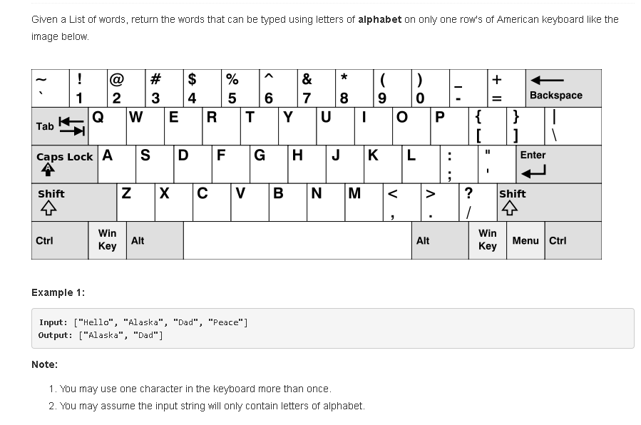
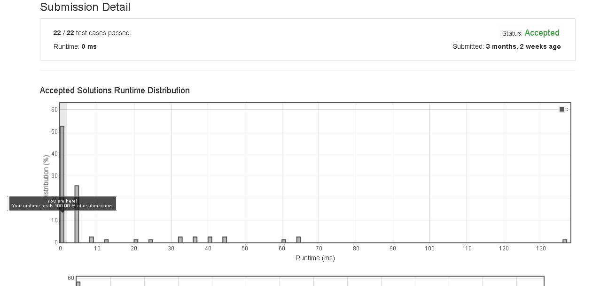

# Keyboard_Row




## submission solution

```c

/**
 * Return an array of size *returnSize.
 * Note: The returned array must be malloced, assume caller calls free().
 */

               //a,b,c,d,e,f,g,h,i,j,k,l,m,n,o,p,q,r,s,t,u,v,w,x,y,z
int table[26] = {2,1,1,2,3,2,2,2,3,2,2,2,1,1,3,3,3,3,2,3,3,1,3,1,3,1};

int get_index(char ch){
    return table[ (tolower(ch) % 'a') ];
}

char** findWords(char** words, int wordsSize, int* returnSize) {
    int size = 0;
    int j=0;
    char** ans = NULL;

    for(int i=0 ; i<wordsSize ; i++){
        j=0;

        char* str = *(words+i);
        int check = get_index(*(str));
        
        while( *(str+j) != '\0' ){
            if( check == get_index(*(str+j)) ){
                //printf("j:%d , strlen : %d , index : %d\n" , j , strlen(str) ,get_index(*(str+j)));
                
                if( j == (strlen(str)-1)){
                    size++;
                    
                    ans = realloc(ans , size * sizeof(char*));
                    for(int k=0 ; k<size ; k++){
                        char* temp = *(ans+k);
                        *(ans+k) = malloc( 256 * sizeof(char));
                        *(ans+k) = temp;
                    }
                    *(ans+(size-1)) = str;
                    
                }
            }
            else{
                break;
            }
            j++;
        }
    }
    *returnSize = size;
    
    return ans;
}

```

