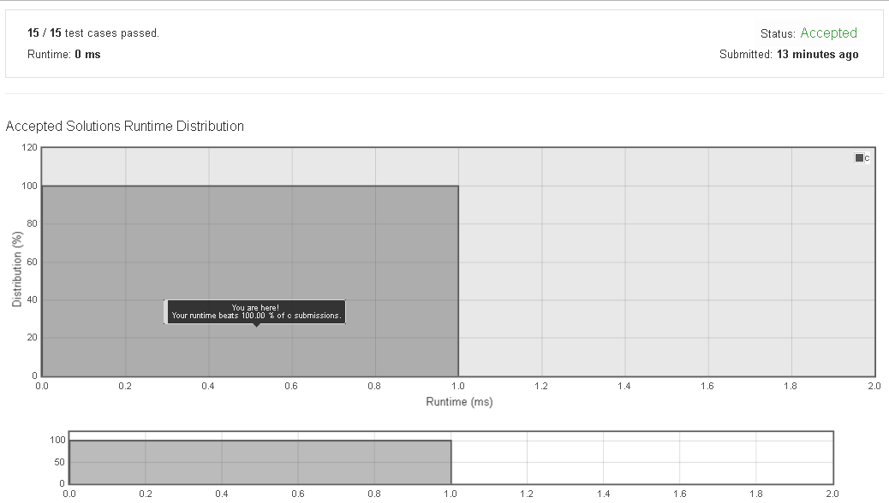

# 876. Middle_of_the_Linked_List

Given a non-empty, singly linked list with head node head, return a middle node of linked list.

If there are two middle nodes, return the second middle node.


Example 1:

Input: [1,2,3,4,5]
Output: Node 3 from this list (Serialization: [3,4,5])
The returned node has value 3.  (The judge's serialization of this node is [3,4,5]).
Note that we returned a ListNode object ans, such that:
ans.val = 3, ans.next.val = 4, ans.next.next.val = 5, and ans.next.next.next = NULL.


Example 2:

Input: [1,2,3,4,5,6]
Output: Node 4 from this list (Serialization: [4,5,6])
Since the list has two middle nodes with values 3 and 4, we return the second one.
 

Note:

The number of nodes in the given list will be between 1 and 100.


## submission solution

```c

/*
解題思考

singly linked-list 只能單向依序 access node
node 之間也只知道下一個 node 的相關訊息，
所以要知道 list 中有多少 node，只能 traversal 一次，取得 node 總數，
接著再從 head = head->next 去移動到想要的 node 位置

要找的 middle node 判斷:

如果是奇數 node
n1 n2 n3 n4 n5
ans : 3

如果是偶數 node , 要 return middle 的第二個 node
n1 n2 n3 n4 n5 n6
ans : 4

所以這兩個答案的計算方法都是，
ans : (total/2)+1

*/


/**
 * Definition for singly-linked list.
 * struct ListNode {
 *     int val;
 *     struct ListNode *next;
 * };
 */

struct ListNode* middleNode(struct ListNode* head) {
    int count = 1;
    struct ListNode *ptr = head;
    while(ptr->next){
        ptr = ptr->next;
        count++;
    }
    for(int i=1 ; i<(count/2)+1 ; i++){
        head = head->next;
    }
    return head;
    
}

```

