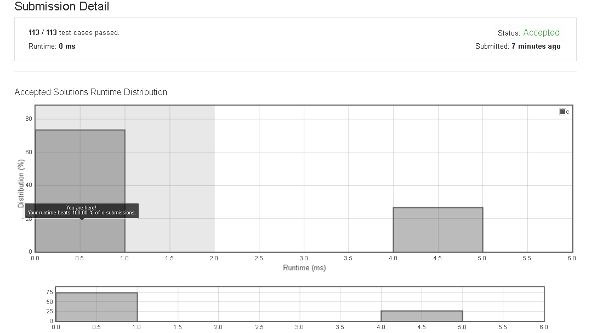

# 27. Remove Element

Given an array nums and a value val, remove all instances of that value in-place and return the new length.

Do not allocate extra space for another array, you must do this by modifying the input array in-place with O(1) extra memory.

The order of elements can be changed. It doesn't matter what you leave beyond the new length.


Example 1:

Given nums = [3,2,2,3], val = 3,

Your function should return length = 2, with the first two elements of nums being 2.

It doesn't matter what you leave beyond the returned length.


Example 2:

Given nums = [0,1,2,2,3,0,4,2], val = 2,

Your function should return length = 5, with the first five elements of nums containing 0, 1, 3, 0, and 4.

Note that the order of those five elements can be arbitrary.

It doesn't matter what values are set beyond the returned length.


Clarification:

Confused why the returned value is an integer but your answer is an array?

Note that the input array is passed in by reference, which means modification to the input array will be known to the caller as well.

Internally you can think of this:

// nums is passed in by reference. (i.e., without making a copy)
int len = removeElement(nums, val);

// any modification to nums in your function would be known by the caller.
// using the length returned by your function, it prints the first len elements.
for (int i = 0; i < len; i++) {
    print(nums[i]);
}


## submission solution

```c

/*
解題思考

假設題目是一個陣列 [4,1,2,3,4,4,7,8,9,4] ,  val : 4,
也就是題目的解答應該是把 4 移除掉的陣列 [1,2,3,7,8,9] , ans == 6 ,

所以先設定一個 struct 
**nums refer 到題目給的 nums , 這樣傳遞 function 只要傳遞結構體的 address , 並且可以直接對題目的 nums 做 in-place swap

ans 配合 get_size 去比對整個陣列 != val 的元素有幾個 , 就是最後的陣列長度答案
vacancy 配合 get_vacancy 去比對陣列從 index == 0 到 index == ans 之間有幾個元素 == val , 這就是要 swap 的位置
所以 while loop 的次數就是 vacancy 的次數

所以可以把原題目陣列分成兩個區間 [(index 0 ~ index ans-1) , (index ans ~ index numsSize-1)]

然後使用 find_and _swap 從第一個區間尋找 == val 的元素 , 並且在第二個區間尋找 != val 的元素 , 做 swap 
總共做 vacancy 次數 , 完成。

*/
struct obj{
    int **nums;
    int size;
    int ans;
    int vacancy;
    int val;
    void (*get_size)(struct obj *);
    void (*get_vacancy)(struct obj *);
    void (*find_and_swap)(struct obj *);
};

void get_size_imp(struct obj *o){
    for(int i=0 ; i<(o->size) ; i++){
        if( *(*(o->nums)+i) != o->val ){
            (o->ans)++;
        }
    }
}

void get_vacancy_imp(struct obj *o){
    for(int i=0 ; i<o->ans ; i++){
        if( *(*(o->nums)+i) == o->val){
            (o->vacancy)++;
        }
    }
}


void find_and_swap_imp(struct obj *o){
    int idx_1 , idx_2;
    for(int i=o->ans ; i<o->size ; i++){
        if( *(*(o->nums)+i) != o->val ){
            idx_1 = i;
            //printf("idx_1 : %d\n", idx_1);
        }
    }
    for(int i=0 ; i<o->ans ; i++){
        if( *(*(o->nums)+i) == o->val ){
            idx_2 = i;
            //printf("idx_2 : %d\n", idx_2);
        }
    }
    int temp = *(*(o->nums)+idx_1);
    *(*(o->nums)+idx_1) = *(*(o->nums)+idx_2);
    *(*(o->nums)+idx_2) = temp;
}

int removeElement(int* nums, int numsSize, int val) {
    struct obj arr = {
        .nums = &nums,
        .size = numsSize,
        .ans = 0,
        .vacancy = 0,
        .val = val
        
    };
    arr.get_size = get_size_imp;
    arr.get_vacancy = get_vacancy_imp;
    arr.find_and_swap = find_and_swap_imp;
    arr.get_size(&arr);
    arr.get_vacancy(&arr);
    
    
    while(arr.vacancy){
        arr.find_and_swap(&arr);
        (arr.vacancy)--;
    }
    printf("\n\n ans : %d\n" , arr.ans);
    return arr.ans;
}
```

