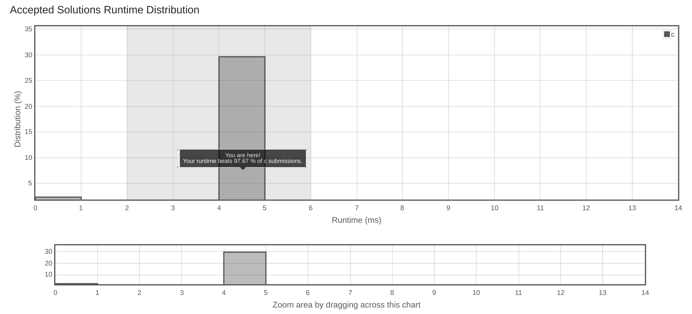

# Running_Sum_of_1d_Array

Given an array nums. We define a running sum of an array as runningSum[i] = sum(nums[0]…nums[i]).

Return the running sum of nums.

Example 1:

Input: nums = [1,2,3,4]
Output: [1,3,6,10]
Explanation: Running sum is obtained as follows: [1, 1+2, 1+2+3, 1+2+3+4].
Example 2:

Input: nums = [1,1,1,1,1]
Output: [1,2,3,4,5]
Explanation: Running sum is obtained as follows: [1, 1+1, 1+1+1, 1+1+1+1, 1+1+1+1+1].
Example 3:

Input: nums = [3,1,2,10,1]
Output: [3,4,6,16,17]
 

Constraints:

1 <= nums.length <= 1000
-10^6 <= nums[i] <= 10^6


## submission solution

```c

/**
 * Note: The returned array must be malloced, assume caller calls free().
 */

 
int* runningSum(int* nums, int numsSize, int* returnSize)
// nums 傳入的陣列
// numsSize 的陣列尺寸
// returnSize 回傳陣列的尺寸
// 回傳 int *
{

    /*  
        演算法 1
        
        sumsArr[0] = 0 + nums[0]
        loop {
            sumsArr[1] = sumsArr[0] + nums[1]
            sumsArr[2] = sumsArr[1] + nums[2]
            sumsArr[3] = sumsArr[2] + nums[3]
            .
            .
            .
        }
    */
    int *sumsArr = malloc(sizeof(int) * numsSize);  // 回傳之 int * 需要 malloc 空間
    sumsArr[0] = nums[0];
    for(int i=1 ; i<numsSize ; i++){
        sumsArr[i] = sumsArr[i-1] + nums[i];
    }

    *returnSize = numsSize; // define return size of sumsArr
    return sumsArr;
    
    /*
        演算法 2
        不申請新的空間，直接使用 nums 計算回傳，節省空間
    */

    if(!numsSize)
        return nums;

    for(int i=1 ; i<numsSize ; i++){
        nums[i] += nums[i-1];
    }
    
    *returnSize = numsSize; 
    return nums;
    
    
}


```

