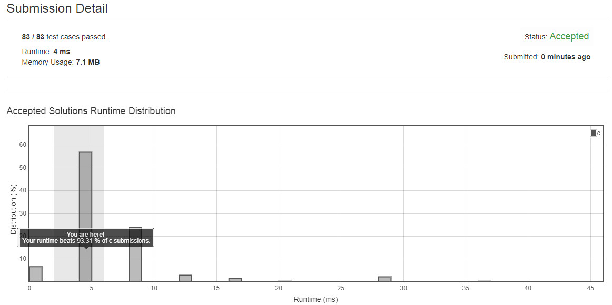
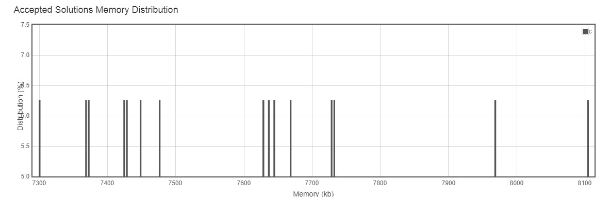

# Unique Morse Code Words


International Morse Code defines a standard encoding where each letter is mapped to a series of dots and dashes, as follows: "a" maps to ".-", "b" maps to "-...", "c" maps to "-.-.", and so on.

For convenience, the full table for the 26 letters of the English alphabet is given below:
[".-","-...","-.-.","-..",".","..-.","--.","....","..",".---","-.-",".-..","--","-.","---",".--.","--.-",".-.","...","-","..-","...-",".--","-..-","-.--","--.."]

Now, given a list of words, each word can be written as a concatenation of the Morse code of each letter. For example, "cba" can be written as "-.-..--...", (which is the concatenation "-.-." + "-..." + ".-"). We'll call such a concatenation, the transformation of a word.

Return the number of different transformations among all words we have.

Example:
Input: words = ["gin", "zen", "gig", "msg"]
Output: 2
Explanation: 
The transformation of each word is:
"gin" -> "--...-."
"zen" -> "--...-."
"gig" -> "--...--."
"msg" -> "--...--."

There are 2 different transformations, "--...-." and "--...--.".


Note:

The length of words will be at most 100.
Each words[i] will have length in range [1, 12].
words[i] will only consist of lowercase letters.

## submission solution

```c

/*

a: ".-",
b: "-...",
c: "-.-.",
d: "-..",
e: ".",
f: "..-.",
g: "--.",
h: "....",
i: "..",
j: ".---",
k: "-.-",
l: ".-..",
m: "--",
n: "-.",
o: "---",
p: ".--.",
q: "--.-",
r: ".-.",
s: "...",
t: "-",
u: "..-",
v: "...-",
w: ".--",
x: "-..-",
y: "-.--",
z: "--.."

解題想法：
先把每一個字串拆解成字母，把每一個字母轉換成 morse code 之後，再 concat 起來，最後再儲存在新的 malloc char ** 裡面；
接著再去比對 malloc char * 陣列中的每一個字串，如果遇到相同的 morse code 字串內容就把重複的字串寫成空字串，
並且計算寫了幾次空字串，把原本 wordsSize - 寫字串的次數就是答案。
*/

char *morseCodeArr[] = {".-","-...","-.-.","-..",".","..-.","--.","....","..",".---","-.-",".-..","--","-.","---",".--.","--.-",".-.","...","-","..-","...-",".--","-..-","-.--","--.."};

void strToMorse(char *str , int index , char **ansCodeArr){
    
    /* 字串的 malloc 空間就以最長的字串來算，字串長度 * 4 再加 1  */
    /* 因為字元轉換成 morse code 最長的是 4 個特殊符號 , 最後再加上 '\0' 的空間  */
    int len = strlen(str);
    char *tempStr = malloc((len*4) +1 );
    
    /*先 strcpy 再 strcat , 然後把每個字元減掉 97 ('a') , 再帶入 morse code array 就可以得到字元對應的 morse code*/
    strcpy(tempStr , *(morseCodeArr + (*str - 'a')) );
    for(int i=1 ; i<len ; i++){
        strcat(tempStr , *(morseCodeArr + (*(str+i) - 'a')) );
        //printf("%c\n" , *(str+i));
    }
    
    /*把 morse code concat 起來之後 , 再回存到 ansCodeArr 準備做 duplicate 比對*/
    *(ansCodeArr+index) = tempStr;
    //printf("%s\n" , tempStr);
    return;
}

int comparing(char **ansCodeArr , int size){
    int ans = size;
    for(int i=0 ; i<(size-1) ; i++){
        
        for(int j=i+1 ; j<size ; j++){
            if( strcmp(*(ansCodeArr+i) , "" ) == 0){
                continue;
            }
            if( strcmp(*(ansCodeArr+i) , *(ansCodeArr+j) ) == 0){
                *(ansCodeArr+j) = "";
                ans--;
                continue;
            }
        }
    }
    return ans;
}

int uniqueMorseRepresentations(char ** words, int wordsSize){
    if(wordsSize < 2){
        return wordsSize;
    }
    char **ansCodeArr = malloc(sizeof(char *) * wordsSize);
    int ans;
    
    for(int i=0 ; i<wordsSize ; i++){
        strToMorse(*(words+i) , i , ansCodeArr );
        //printf("in main : %s\n" , *(ansCodeArr+i));
    }
    return comparing(ansCodeArr , wordsSize);
}


```


