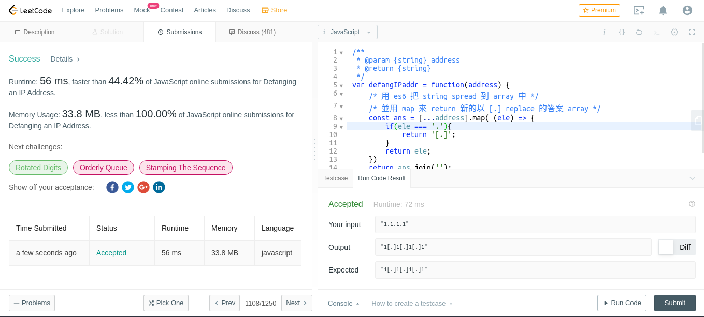

# defanging-an-ip-address

Given a valid (IPv4) IP address, return a defanged version of that IP address.
A defanged IP address replaces every period "." with "[.]".

Example 1:

Input: address = "1.1.1.1"
Output: "1[.]1[.]1[.]1"

Example 2:

Input: address = "255.100.50.0"
Output: "255[.]100[.]50[.]0"
 
Constraints:

The given address is a valid IPv4 address.

## submission solution

```javascript
/**
 * @param {string} address
 * @return {string}
 */
var defangIPaddr = function(address) {
    /* 用 es6 把 string spread 到 array 中 */
    /* 並用 map 來 return 新的以 [.] replace 的答案 array */
    const ans = [...address].map( (ele) => {
        if(ele === '.'){
            return '[.]';
        }
        return ele;
    })
    return ans.join('');
};


```

