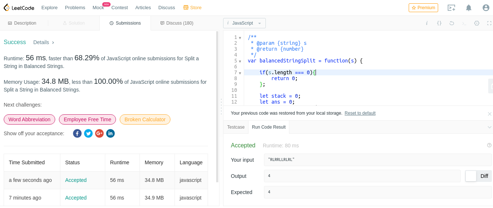

# split-a-string-in-balanced-strings

Balanced strings are those who have equal quantity of 'L' and 'R' characters.
Given a balanced string s split it in the maximum amount of balanced strings.
Return the maximum amount of splitted balanced strings.

Example 1:

Input: s = "RLRRLLRLRL"
Output: 4
Explanation: s can be split into "RL", "RRLL", "RL", "RL", each substring contains same number of 'L' and 'R'.

Example 2:

Input: s = "RLLLLRRRLR"
Output: 3
Explanation: s can be split into "RL", "LLLRRR", "LR", each substring contains same number of 'L' and 'R'.

Example 3:

Input: s = "LLLLRRRR"
Output: 1
Explanation: s can be split into "LLLLRRRR".

Constraints:

1 <= s.length <= 1000
s[i] = 'L' or 'R'

## submission solution

```javascript
/**
 * @param {string} s
 * @return {number}
 */
var balancedStringSplit = function(s) {
    
    if(s.length === 0){
        return 0;
    };
    /* 使用 stack push 及 pop 的概面 */
    /* 以 +1,-1 來計算平衡數*/
    let stack = 0;
    let ans = 0;
    const len = s.length;
    
    for(let i=0 ; i<len ; i++){
        if(s[i] === 'R'){
            stack++;
        };
        if(s[i] === 'L'){
            stack--;
        };
        if(stack === 0){
            ans++;
        };
    };
    return ans;
};

```

